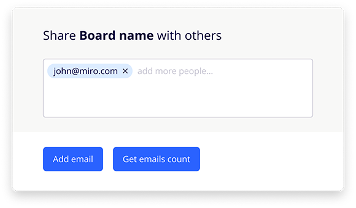

# Emails Editor Library


 [Demo](http://xn--80adklohlho5j.xn--p1ai/emails-editor)

Advantages and opportunities:
- Each entered email is formed into a block. You can delete a block.
- The entered email is formed into a block after pressing Enter, setting a comma after the email, clicking CTR + V, and also when the input field loses focus.
- The width of the email block depends on the width of the parent container. If the container changes the width, the blocks with emails are reallocated along the lines.
-When entering a large number of emails, scrolling appears.
- Invalid emails are formed in blocks with red underscores.
- By clicking on the "Add email" button, a random email is added to the list.
- By clicking on the "Get emails count" button, an alert is displayed with the number of valid emails entered.
- The interface of the emails-editor library must be designed in such a way that it can be used in any web application
- The emails-editor library allows you to create more than one instance of the editor on a page.
- Emails-editor library without third-party libraries.


To get started, download resources from <b>/dist/</b> 

Add library resources:
```html
<link rel="stylesheet" href="css/emails-editor.min.css">
<script src="js/emails-editor.min.js"></script>
```

Then create a div tag with any id.
Example:
```html
<div id="emails-editor"></div>
```

Then call the function with the necessary settings:
```javascript
EmailsEditor({ 
 idElement: "emails-editor", // The ID of the container 
 mailCounter: true, // Enable item counter 
 btnDeleteInvalid: true, // Enable the all invalid email delete button
 setEmail: 1 // Preset number of emails
});
```